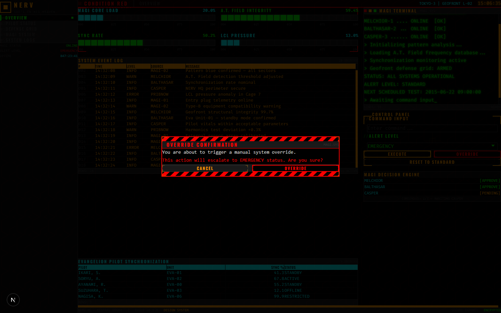

<p align="center">
  
  
</p>

<h1 align="center">
  <code>EVA UI</code>
</h1>

<p align="center">
  <strong>A React component library inspired by the NERV/MAGI interfaces from Neon Genesis Evangelion.</strong><br/>
  Brutalist. Industrial. Zero border-radius. Maximum impact.
</p>

<p align="center">
  
  
  
  
  
</p>

---

## SCREENSHOTS

### Command Center — Normal Operations


### Condition Red — Emergency Mode


### System Dialog — Override Confirmation


---

## SYSTEM OVERVIEW

EvaUI is a React component library that faithfully recreates the aesthetic of the NERV headquarters interfaces from Neon Genesis Evangelion. Every component follows strict design rules:

- **Zero border-radius** — brutalist industrial angles only
- **NERV color palette** — black base, alert red, text orange, grid green, data cyan
- **Condensed uppercase typography** — military-grade display fonts
- **Monospace terminal text** — for all data and code elements
- **CRT scanline overlay** — subtle retro display effect
- **Animated hazard stripes** — for emergency and destructive states
- **`prefers-reduced-motion` support** — accessible by default

## COMPONENTS

| Component | Description |
|-----------|-------------|
| `<EmergencyBanner />` | Full-screen alert with hazard stripes and flickering text |
| `<TerminalDisplay />` | Monospace terminal with typewriter effect and blinking cursor |
| `<TargetingContainer />` | Wrapper with L-brackets and crosshair grid background |
| `<HexGridBackground />` | SVG honeycomb pattern (A.T. Field aesthetic) |
| `<Button />` | Industrial button with hover color inversion |
| `<InputField />` | Terminal-style input with focus brackets `[ ]` |
| `<SelectMenu />` | Styled dropdown with angle brackets `< >` |
| `<SyncProgressBar />` | Block-based LCD progress bar with dynamic colors |
| `<DataGrid />` | Surveillance-style data table with auto-scroll |
| `<SystemDialog />` | Modal with hex overlay and hazard stripe framing |
| `<NavigationTabs />` | Military-classified folder tabs |

## QUICK START

```bash
# Clone the repository
git clone https://github.com/MattLoyeD/neon-genesis-evangelion.git
cd neon-genesis-evangelion

# Install dependencies
npm install

# Start the development server
npm run dev
```

Open [http://localhost:3000](http://localhost:3000) to see the **NERV Command Center** demo dashboard.

## USAGE

```tsx
import {
  EmergencyBanner,
  TerminalDisplay,
  Button,
  SyncProgressBar,
  DataGrid,
} from "@/components";

// Emergency banner
<EmergencyBanner
  text="WARNING"
  severity="warning"
  visible={showAlert}
/>

// Terminal with typewriter
<TerminalDisplay
  lines={["MAGI SYSTEM ONLINE", "> Awaiting input..."]}
  typewriter
  color="green"
/>

// Styled button
<Button variant="danger" size="lg">
  INITIATE OVERRIDE
</Button>

// LCD progress bar
<SyncProgressBar
  value={78.5}
  label="SYNC RATE"
  blocks={20}
/>
```

## DESIGN TOKENS

```css
/* Colors */
--color-eva-black:     #000000   /* Background */
--color-eva-red:       #FF0000   /* Emergency alerts */
--color-eva-orange:    #FF9900   /* Primary text & accents */
--color-eva-green:     #00FF00   /* Terminal & grid */
--color-eva-cyan:      #00FFFF   /* Data & secondary info */

/* Typography */
--font-eva-display:    Oswald, Impact, system-ui
--font-eva-mono:       Fira Code, Courier New, monospace
--font-eva-body:       Barlow Condensed, Arial Narrow, system-ui
```

## PROJECT STRUCTURE

```
src/
├── app/
│   ├── globals.css          # Design tokens & global styles
│   ├── layout.tsx           # Root layout
│   └── page.tsx             # Command Center demo dashboard
├── components/
│   ├── EmergencyBanner/
│   ├── TerminalDisplay/
│   ├── TargetingContainer/
│   ├── HexGridBackground/
│   ├── Button/
│   ├── InputField/
│   ├── SelectMenu/
│   ├── SyncProgressBar/
│   ├── DataGrid/
│   ├── SystemDialog/
│   ├── NavigationTabs/
│   └── index.ts             # Barrel exports
└── lib/
    └── mock-data.ts         # Demo dashboard data
```

## TECH STACK

- **React 19** — Functional components with Hooks
- **TypeScript** — Strict typing for all component props
- **Tailwind CSS 4** — Utility-first with custom design tokens
- **Framer Motion 12** — Animations (flicker, typewriter, transitions)
- **Next.js 15** — App Router, SSR-compatible

## ACCESSIBILITY

- All flashing/blinking animations respect `prefers-reduced-motion`
- Semantic HTML roles (`role="alert"`, `role="dialog"`, `role="progressbar"`, `role="tablist"`)
- ARIA attributes on interactive components
- Keyboard navigable

## LICENSE

MIT License. See [LICENSE](./LICENSE).

---

<p align="center">
  <code>GOD'S IN HIS HEAVEN. ALL'S RIGHT WITH THE WORLD.</code>
</p>
