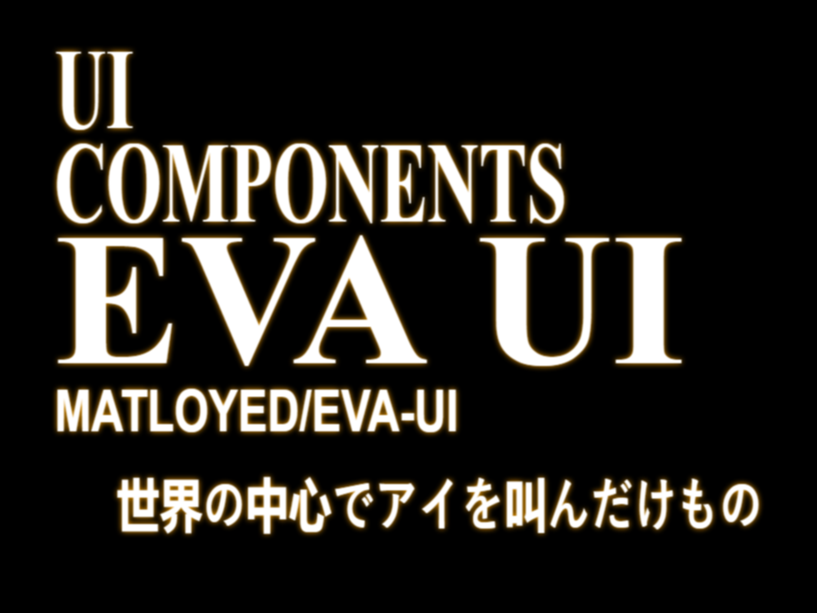
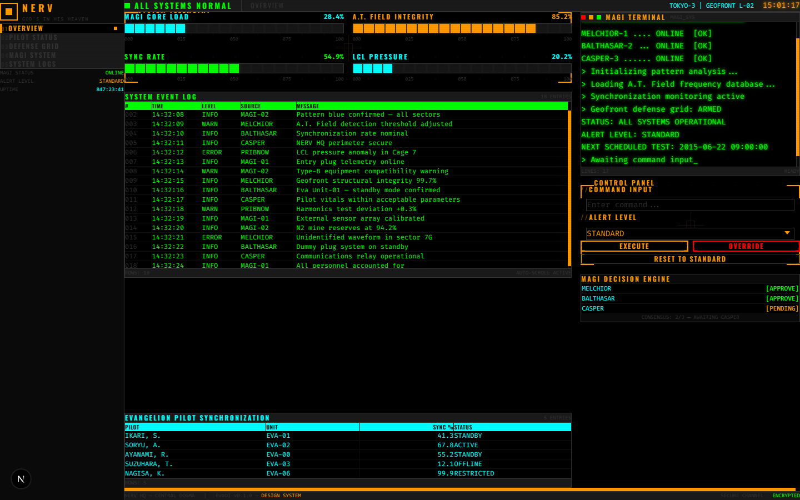
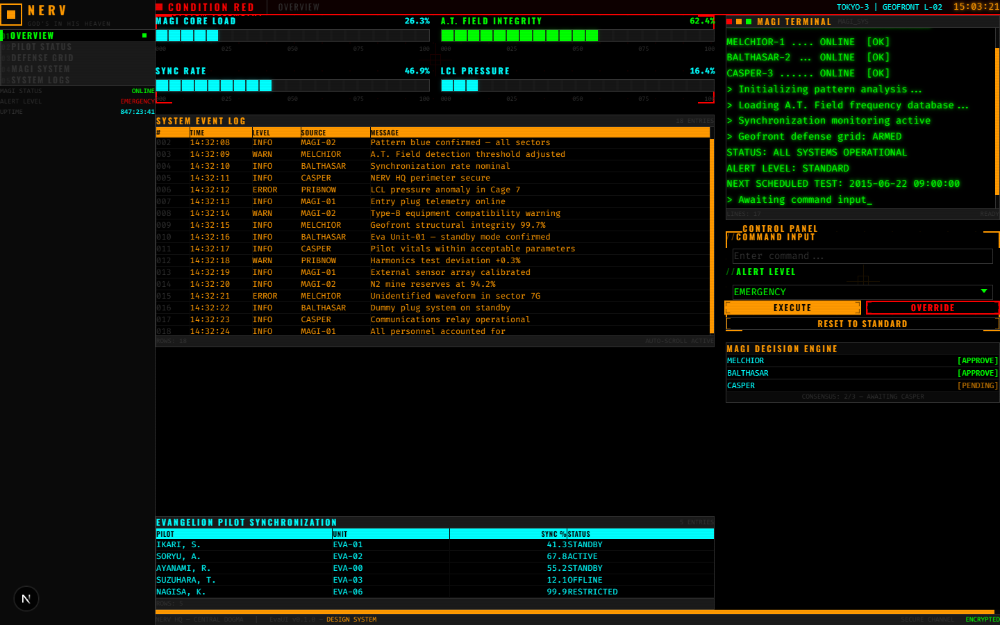

<p align="center">
  
  
  
</p>

<p align="center">
  
</p>

<p align="center">
  <strong>Brutalist. Industrial. Zero border-radius. Maximum impact.</strong><br/>
  <sub>A React UI toolkit that faithfully recreates the NERV headquarters interfaces from Neon Genesis Evangelion.</sub>
</p>

<p align="center">
  
</p>

<p align="center">
  
  
  
  
  
</p>

---

## `> VISUAL_FEED :: NORMAL_OPERATIONS`



## `> VISUAL_FEED :: CONDITION_RED`



---

## `> SYSTEM_OVERVIEW`

EvaUI is a **17-component React design system** built to replicate the iconic CRT-era military interfaces of NERV headquarters. Every pixel follows strict brutalist design rules:

- **`border-radius: 0`** everywhere — sharp industrial angles only
- **NERV color palette** — black void, alert red, text orange, grid green, data cyan, magenta wave
- **Condensed uppercase typography** — Oswald, Barlow Condensed, Noto Serif JP
- **Monospace terminal text** — Fira Code for all data readouts
- **CRT scanline overlay** — persistent retro phosphor effect
- **Animated hazard stripes** — diagonal moving patterns for danger states
- **`prefers-reduced-motion`** — all animations respect accessibility settings

## `> COMPONENT_MANIFEST`

### Phase 1 — Core Interface Elements

| Component | Description | Key Props |
|-----------|-------------|-----------|
| [`<EmergencyBanner />`](docs/COMPONENTS.md#emergencybanner) | Full-screen alert with hazard stripes and flickering text | `text`, `severity`, `visible` |
| [`<TerminalDisplay />`](docs/COMPONENTS.md#terminaldisplay) | Monospace terminal with typewriter effect and cursor | `lines`, `typewriter`, `color` |
| [`<TargetingContainer />`](docs/COMPONENTS.md#targetingcontainer) | L-bracket wrapper with crosshair grid | `label`, `color`, `bracketSize` |
| [`<HexGridBackground />`](docs/COMPONENTS.md#hexgridbackground) | SVG honeycomb A.T. Field pattern | `color`, `opacity`, `hexSize` |
| [`<Button />`](docs/COMPONENTS.md#button) | Industrial button with hover inversion | `variant`, `size`, `loading` |
| [`<InputField />`](docs/COMPONENTS.md#inputfield) | Terminal input with focus brackets `[ ]` | `label`, `color`, `error` |
| [`<SelectMenu />`](docs/COMPONENTS.md#selectmenu) | Dropdown with angle brackets `< >` | `options`, `color`, `placeholder` |
| [`<SyncProgressBar />`](docs/COMPONENTS.md#syncprogressbar) | Block-based LCD progress bar | `value`, `label`, `blocks` |
| [`<DataGrid />`](docs/COMPONENTS.md#datagrid) | Surveillance data table with auto-scroll | `columns`, `data`, `autoScroll` |
| [`<SystemDialog />`](docs/COMPONENTS.md#systemdialog) | Modal with hex overlay and hazard framing | `open`, `severity`, `onAccept` |
| [`<NavigationTabs />`](docs/COMPONENTS.md#navigationtabs) | Military classified folder tabs | `tabs`, `activeTab`, `onTabChange` |

### Phase 2 — Advanced Systems

| Component | Description | Key Props |
|-----------|-------------|-----------|
| [`<EvaTitleScreen />`](docs/COMPONENTS.md#evatitlescreen) | Cinematic title card with serif typography | `title`, `subtitle`, `align` |
| [`<MagiSystemPanel />`](docs/COMPONENTS.md#magisystempanel) | 3-column MAGI supercomputer voting display | `votes[]`, `title` |
| [`<SyncRatioChart />`](docs/COMPONENTS.md#syncratiochart) | Pure SVG dual sinusoidal waveform chart | `frequencyA/B`, `amplitudeA/B` |
| [`<CountdownTimer />`](docs/COMPONENTS.md#countdowntimer) | LCD countdown with battery bar | `initialSeconds`, `onExpire` |
| [`<SeeleMonolith />`](docs/COMPONENTS.md#seelemonolith) | SOUND ONLY monolith with equalizer | `id`, `isSpeaking` |
| [`<ClassifiedOverlay />`](docs/COMPONENTS.md#classifiedoverlay) | TOP SECRET overlay with unlock mechanism | `text`, `isUnlocked`, `children` |

> Full API reference with all props, types, and defaults: **[docs/COMPONENTS.md](docs/COMPONENTS.md)**

---

## `> INSTALLATION`

```bash
npm install @mattloyed/eva-ui
```

**Peer dependencies** — make sure these are installed in your project:

```bash
npm install react react-dom framer-motion
```

> `tailwindcss` is an optional peer dependency — needed only if you use the included Tailwind preset.

Then import components directly:

```tsx
import { Button, TerminalDisplay, EmergencyBanner } from "@mattloyed/eva-ui";
```

---

## `> QUICK_START` (development / demo)

To run the demo dashboard locally:

```bash
git clone https://github.com/MattLoyeD/eva-ui.git
cd eva-ui
npm install
npm run dev
```

Open [http://localhost:3000](http://localhost:3000) — the **NERV Command Center** demo dashboard will initialize.

## `> USAGE_EXAMPLE`

```tsx
import {
  EmergencyBanner,
  TerminalDisplay,
  Button,
  MagiSystemPanel,
  CountdownTimer,
} from "@mattloyed/eva-ui";

// Full-screen emergency alert
<EmergencyBanner
  text="WARNING"
  subtext="PATTERN BLUE DETECTED"
  severity="warning"
  visible={isAlert}
/>

// Terminal with typewriter animation
<TerminalDisplay
  lines={["MAGI SYSTEM v2.11", "> Initializing...", "> CASPER online"]}
  typewriter
  color="green"
/>

// MAGI voting panel
<MagiSystemPanel
  votes={[
    { name: "MELCHIOR 1", status: "accepted" },
    { name: "BALTHASAR 2", status: "accepted" },
    { name: "CASPER 3", status: "rejected" },
  ]}
/>

// LCD countdown with expiry callback
<CountdownTimer initialSeconds={300} onExpire={() => alert("TIME UP")} />
```

---

## `> DESIGN_TOKENS`

The design system uses strict NERV-specification color tokens and typography. All tokens are defined as CSS custom properties via Tailwind CSS 4's `@theme` block.

```
COLOR             HEX        USAGE
─────────────────────────────────────────────
eva-black         #000000    Background void
eva-red           #FF0000    Emergency / alerts
eva-orange        #FF9900    Primary text & UI
eva-green         #00FF00    Terminal / grid lines
eva-cyan          #00FFFF    Data readouts
eva-magenta       #FF00FF    Waveform accents
eva-lcd-green     #39FF14    LCD displays
eva-amber         #FFAA00    Warning states
eva-purple        #9933FF    Special indicators

TYPOGRAPHY        FAMILY                         USAGE
─────────────────────────────────────────────────────────
eva-display       Oswald, Impact                 Headers & labels
eva-mono          Fira Code, JetBrains Mono      Terminal & data
eva-body          Barlow Condensed               Body text
eva-title         Noto Serif JP, Playfair         Cinematic titles
```

> Full token reference: **[docs/DESIGN_TOKENS.md](docs/DESIGN_TOKENS.md)**

---

## `> PROJECT_STRUCTURE`

```
src/
├── app/
│   ├── globals.css          # @theme tokens & global CRT styles
│   ├── layout.tsx           # Root layout + Google Fonts
│   ├── icon.svg             # EVA favicon
│   └── page.tsx             # NERV Command Center demo
├── components/
│   ├── EmergencyBanner/     # Alert banners
│   ├── TerminalDisplay/     # Terminal emulator
│   ├── TargetingContainer/  # L-bracket wrapper
│   ├── HexGridBackground/   # A.T. Field hexagons
│   ├── Button/              # Multi-variant button
│   ├── InputField/          # Terminal input
│   ├── SelectMenu/          # Styled dropdown
│   ├── SyncProgressBar/     # LCD progress bar
│   ├── DataGrid/            # Data surveillance table
│   ├── SystemDialog/        # Modal dialog
│   ├── NavigationTabs/      # Classified tabs
│   ├── EvaTitleScreen/      # Cinematic title card
│   ├── MagiSystemPanel/     # MAGI supercomputer
│   ├── SyncRatioChart/      # SVG waveform chart
│   ├── CountdownTimer/      # LCD countdown
│   ├── SeeleMonolith/       # SOUND ONLY block
│   ├── ClassifiedOverlay/   # TOP SECRET overlay
│   └── index.ts             # Barrel exports
```

## `> TECH_STACK`

| Technology | Version | Role |
|-----------|---------|------|
| React | 19 | Functional components with Hooks |
| TypeScript | 5.8 | Strict typing for all props |
| Tailwind CSS | 4 | Utility-first + `@theme` design tokens |
| Framer Motion | 12 | Flicker, typewriter, transitions |
| Next.js | 15 | App Router, static export for GitHub Pages |

## `> ACCESSIBILITY`

All components are built with accessibility in mind:

- `prefers-reduced-motion` disables all animations and CRT scanlines
- Semantic HTML: `role="alert"`, `role="dialog"`, `role="progressbar"`, `role="tablist"`
- ARIA attributes on all interactive elements
- Full keyboard navigation support
- High contrast color palette (WCAG compliant on dark backgrounds)

## `> DEPLOYMENT`

The project auto-deploys to GitHub Pages via GitHub Actions on every push to `master`. Once deployed, the live demo will be available at:

**https://mattloyed.github.io/eva-ui**

To build the static export locally:

```bash
npm run build    # Outputs to ./out/
```

## `> LICENSE`

MIT License. See [LICENSE](./LICENSE).

---

<p align="center">

```
┌──────────────────────────────────────────────────┐
│                                                    │
│   GOD'S IN HIS HEAVEN. ALL'S RIGHT WITH THE WORLD │
│                                                    │
└──────────────────────────────────────────────────┘
```

</p>
